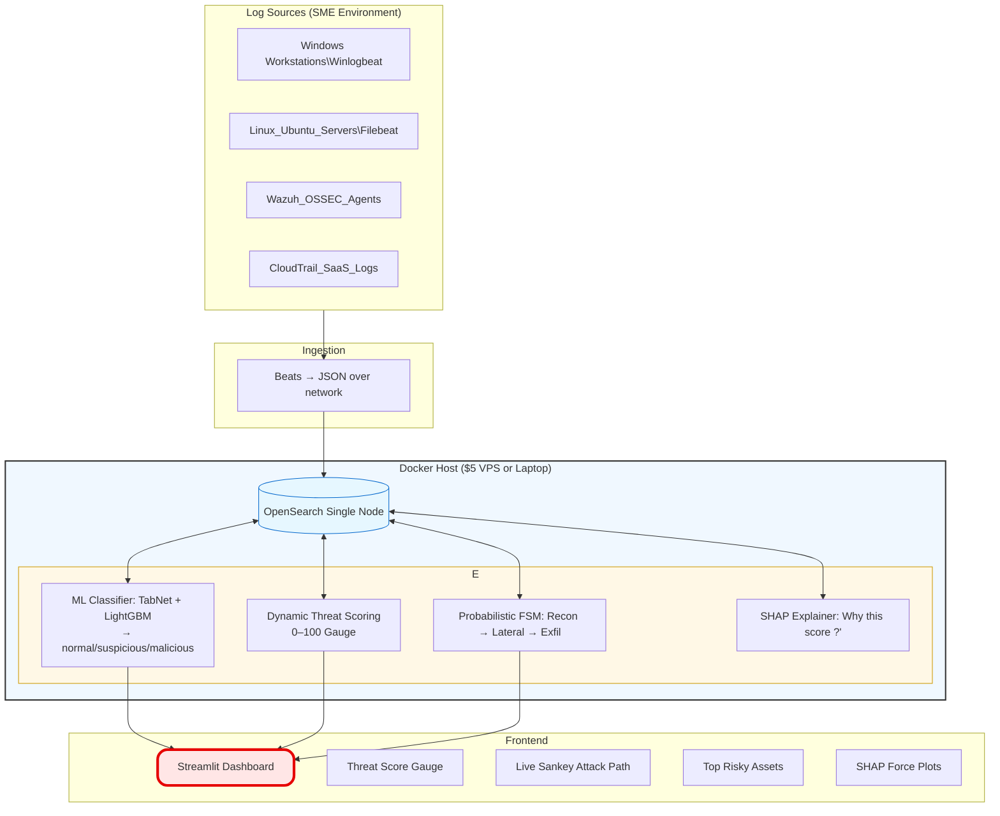

# RiskPulse AI
**AI-Driven Cyber Risk Scoring Engine for SMEs**  
Turns raw logs into a single 0–100 threat score + real-time attack-path visualization.

Not a SIEM. A lightweight risk intelligence layer on top of any log source.

### System Architecture (purposed)
# RiskPulse AI – System Architecture


### Core Features (MVP)
- ML classification (TabNet + SHAP) → normal / suspicious / malicious
- Dynamic Threat Score 0–100 (explainable, auto-weighted)
- Probabilistic FSM attack-path modeling (Recon → Exfil)
- Live Sankey attack flow diagram
- Streamlit dashboard (gauge + Sankey + top risky assets)
- Runs on $5–10/month VPS or Raspberry Pi

### Built For
Small and medium businesses (5–250 employees) that cannot afford or manage Wazuh/Kibana.

### Tech Stack
- Log ingestion: Filebeat / Winlogbeat
- Storage: OpenSearch (single-node)
- ML: TabNet or LightGBM
- Scoring & FSM: Python + NetworkX
- Dashboard: Streamlit + Plotly

### Quick Start
```bash
git clone https://github.com/yourusername/riskpulse-ai.git
cd riskpulse-ai
docker compose up -d          # OpenSearch
pip install -r requirements.txt
python scripts/ingest_sample.py
streamlit run app/main.py
